# UDP MpegTS to HLS VOD for UDP MpegTS Re-Stream

UDP to HLS enables capturing of MPEG-TS UDP multicast streams, segmenting them into time-based HLS segments, creating `.m3u8` playlists, and uploading them to MinIO or S3 storage. The segments and playlists can then be signed for secure playback. You can also run diskless and not store the segments locally, only in memory and upload to S3/MinIO. It has a container deployment option using Podman that sets up a local MinIO server and the capture application. See the hls to udp relay for a way to replay the content [hls-to-udp](hls-to-udp/README.md).

```mermaid
graph LR
    A["UDP<br/>Multicast<br/>Stream"] -->|"Captured via libpcap"| B["Capture<br/>Module"]
    B -->|"MPEG-TS"| C["Segmentation<br/>Process"]
    C -->|"Segment"| D["HLS Segments<br/>and Playlist"]
    D -->|"Upload"| E["S3/MinIO<br/>Upload"]
    E -->|"URLs"| F["HLS<br/>Playlist"]
    F -->|"HTTP HLS Server"| G["HTTP<br/>Download"]
    G -->|"MpegTS UDP"| H["MpegTS UDP<br/>Multicast<br/>Stream"]
    H ~~~ Z1[" "]
    Z1 ~~~ Z2[" "]

    style A fill:#b3e0ff,stroke:#0066cc,stroke-width:2px,color:#003366,font-weight:bold
    style B fill:#b3ffb3,stroke:#006600,stroke-width:2px,color:#003300,font-weight:bold
    style C fill:#ffb3ff,stroke:#660066,stroke-width:2px,color:#330033,font-weight:bold
    style D fill:#ffcc80,stroke:#995200,stroke-width:2px,color:#663300,font-weight:bold
    style E fill:#ff99cc,stroke:#cc0066,stroke-width:2px,color:#660033,font-weight:bold
    style F fill:#e6b3e6,stroke:#660066,stroke-width:2px,color:#330033,font-weight:bold
    style G fill:#b3b3e6,stroke:#000066,stroke-width:2px,color:#000033,font-weight:bold
    style H fill:#b3e0ff,stroke:#0066cc,stroke-width:2px,color:#003366,font-weight:bold
    style Z1 fill:none,stroke:none,color:transparent
    style Z2 fill:none,stroke:none,color:transparent
```



---

## Quick Start Guide (Containerized)
```bash
git clone https://github.com/groovybits/mpegts_to_s3.git
cd mpegts_to_s3

# Edit the config.env file to set the desired settings
vim config.env

# Start MinIO and the Mpeg_to_S3 capture using config.env values for settings
podman-compose up --build
```

There is a container at `docker.io/groovybits/mpegts_to_s3:latest` which can be used.

## Quick Start Guide (Local Build)

### Clone and Build the Project
```bash
git clone https://github.com/groovybits/mpegts_to_s3.git
cd mpegts_to_s3

# Build the application in release mode
cargo build --release
```

### Configure and Run the Components
#### 1. Start MinIO Server
```bash
# Start the MinIO server (uses ./data/ for storage)
TARGET_SERVER=192.168.1.1 scripts/minio_server.py &
```

#### 2. Serve HLS Playlist
```bash
# Create HLS directory for serving the index.m3u8 file
mkdir hls && cd hls

# Run Python HTTP Server to serve files from the ./hls/ directory
../scripts/http_server.py &
```

#### 3. Capture and Segment UDP Stream
```bash
# Capture multicast stream from udp://224.0.0.200:10001 on interface eth0
# Segments can be saved to ./ts/ directory with 2-second duration and uploaded to S3/MinIO
SEGMENT_DURATION_SECONDS=2 \
../target/release/udp-to-hls \
    -n eth0 \         # Network interface for packet capture
    -i 224.0.0.200 \  # Multicast IP to filter
    -p 10001 \         # UDP port to filter
    -o ts \           # Output directory for .ts segments
    --diskless_mode   # Diskless mode avoids writing .ts segments to disk
```

#### 4. Playback
- **Direct Playback:**
  1. Use the index.m3u8 for playback of the current live stream:
     ```bash
     mpv -i http://127.0.0.1:3001/index.m3u8
     ```

- **MinIO Playback:**
  1. Retrieve the signed URL for the desired hour:
     ```bash
     curl -s http://127.0.0.1:3001/ts/urls.log | tail -1
     ```
  2. Setup an SSH tunnel for the HTTP server:
     ```bash
     scripts/minio_tunnel.sh
     ```
  3. Play back the hourly playlist:
     ```bash
     mpv http://127.0.0.1:9000/ltnhls/2025/01/16/06/hourly_index.m3u8?...(signed_url_params)
     ```

- **Custom Playback with hls-to-udp relay**
  1. Start the hls-to-udp relay
     ```bash
     cd hls-to-udp
     cargo build --release
     ./target/release/hls-to-udp -u http://127.0.0.1:3001/index.m3u8 -o 224.0.0.200:10001
     ```
  2. Play the relayed stream
     ```bash
     mpv udp://224.0.0.200:10001
     ```
---

## Prerequisites

- **Rust Toolchain:** Install via [Rustup](https://rustup.rs/).
- **MinIO/S3 Server:** Ensure MinIO is available locally or via a container.
- **Dependencies:** Install `libpcap` for packet capture and FFmpeg (optional) for HLS segment generation.
- **Ports:** Open ports 9000 and 9001 for MinIO and the HTTP server.
- **SSH Tunneling:** For HTTP access to MinIO, set up SSH forwarding.

---

## Usage

```bash
udp-to-hls [OPTIONS]
```
### Options:
- **General Settings:**
  - `-e`, `--endpoint`: S3-compatible endpoint (default: `http://127.0.0.1:9000`)
  - `-r`, `--region`: S3 region (default: `us-east-1`)
  - `-b`, `--bucket`: S3 bucket name (default: `ltnhls`)
- **UDP Stream Capture:**
  - `-i`, `--udp_ip`: Multicast IP to filter (default: `227.1.1.102`)
  - `-p`, `--udp_port`: UDP port to filter (default: `4102`)
  - `-n`, `--interface`: Network interface for packet capture (default: `net1`)
  - `-t`, `--timeout`: Packet capture timeout in milliseconds (default: `1000`)
- **HLS Output:**
  - `-o`, `--output_dir`: Local directory for HLS output (default: `ts`)
  - `--remove_local`: Remove local `.ts` and `.m3u8` files after upload
  - `--hls_keep_segments`: Number of segments to keep in the `.m3u8` index (0 = unlimited, default: `10`)
  - `--diskless_mode`: Diskless mode avoids writing `.ts` segments to disk (default: `false`) requires --manual_segment arg.

### Environment Variables:
  - `SEGMENT_DURATION_MS`: Duration of each segment in milliseconds (default: `1000`), (less than 1 second may not work well)
  - `FILE_MAX_AGE_SECONDS`: Maximum age of files in seconds to upload (default: `30`)
  - `URL_SIGNING_SECONDS`: Duration of signed URLs in seconds (default: `31104004`)
  - `MINIO_ROOT_USER`: S3 username / access key ID (default: `minioadmin`)
  - `MINIO_ROOT_PASSWORD`: S3 password / secret access key (default: `ThisIsSecret12345.`)
  - `PCAP_PACKET_COUNT`: Number of packets to capture at a time (default: `7`)
  - `PCAP_PACKET_SIZE`: Size of mpegts packets to capture (default: `188`)
  - `PCAP_PACKET_HEADER_SIZE`: Size of mpegts packet ip/eth header (default: `42`)
  - `PACAP_BUFFER_SIZE`: Size of the pcap buffer (default: `4194304`)
  - `USE_ESTIMATED_DURATION`: Use estimated duration for manual segmentation (default: `true`)
  - `HLS_INPUT_URL`: hls-to-udp input URL (default: `http://127.0.0.1:3001/index.m3u8`)
  - `UDP_OUTPUT_IP`: hls-to-udp output IP for UDP (default: `224.0.0.200`)
  - `UDP_OUTPUT_PORT`: hls-to-udp output port for UDP (default: `10000`)

---

## How It Works

1. **Capture:** The application uses `libpcap` to capture UDP multicast MPEG-TS packets on a specified interface.
2. **Segment:** It either:
   - **Automatically segments** streams with FFmpeg
   - **Manually segments** streams by directly processing MPEG-TS packets
3. **Upload:** A directory watcher uploads new `.ts` segments and playlists to S3 or MinIO.
4. **Playback:** The uploaded segments are accessible via signed or unsigned URLs, enabling HLS playback.

---

## Monitoring and Logs
- **MinIO Web Interface:** View uploaded files via the MinIO web client.
- **Segment Logs:** Signed URL logs are stored in `urls.log` in the output directory.

---

## Example File Structure
```text
hls/
├── index.m3u8
├── 2025/
    └── 01/
        └── 16/
            └── 06/
                ├── segment_20250116-060000__0000.ts
                └── hourly_index.m3u8
```
---

## Development Notes

The full source code is located in the `src/` directory. Additional utility scripts for managing MinIO and HTTP servers are available in the `scripts/` folder.

For questions or issues, refer to the repository's issue tracker.

---

**Author:** wizard@groovy.org
**Date:** January 15, 2025

