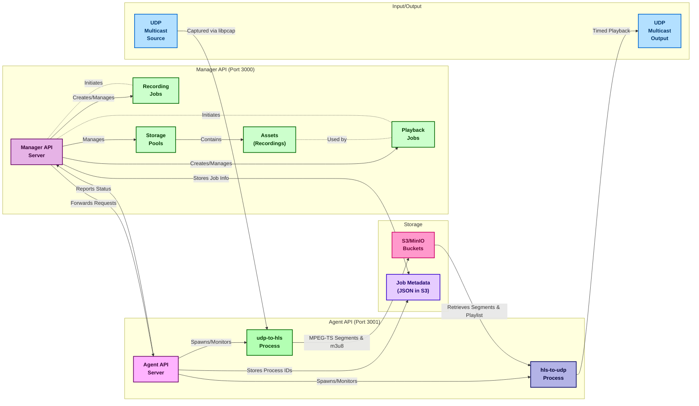

# UDP to HLS MpegTS Capture to Cloud Storage

UDP to HLS enables capturing of MPEG-TS UDP multicast streams, segmenting them into time-based HLS segments, creating `.m3u8` playlists, and uploading them to MinIO or S3 storage. The segments and playlists can be signed for secure playback. It runs diskless and doesn't store segments locally, only in memory and upload to S3/MinIO. It has an [API](recording-playback-api/API.md) for Recording, Playback and Storage Pool management. The API server is a Node.js application that manages the recording and playback jobs, storage pools, and assets. It communicates with the agent to start and stop recording/playback jobs.

There are container image build and compose options using Podman/Docker + *-Compose that set up a local MinIO server and an API Server consisting of a Manager and an Agent that runs the udp-to-hls and hls-to-udp when requested. See  [hls-to-udp](hls-to-udp/README.md) and the API Server in Node.js [recording-playback-api](recording-playback-api).



---

## Quick Start Guide (Containerized)
```bash
git clone https://github.com/groovybits/mpegts_to_s3.git
cd mpegts_to_s3

# Edit the config.env file to set the desired settings
ls configs/*.env && cp -R configs configs_custom && vim configs_custom/*.env
# Then edit the docker-compose_* manager and agent to point to the custom configs

# Start MinIO Server
podman-compose -f docker-compose_minio.yml up -d --build

# With the API server, Start MinIO, the Mpeg_to_S3 capture, and the API server
podman-compose -f docker-compose_apiserver.yml up --build

# Now browse to the host IP on port 3000 to access the API server swagger UI
# webbrowser --url http://localhost:3000/api-docs  # Manager default port is 3000
# webbrowser --url http://localhost:3001/api-docs  # Agent default port is 3001
```

There are official stable release containers available at: 
- `docker.io/groovybits/manager:latest`
- `docker.io/groovybits/agent:latest`

## Quick Start Guide (Local Build)

### Clone and Build the Project 
```bash
git clone https://github.com/groovybits/mpegts_to_s3.git
cd mpegts_to_s3

# Build the udp-to-hls application in release mode
make && make install
```

### Configure and Run the Components
#### Start MinIO Server (runs on ports 9000 and 9001 like S3)
```bash
# Start the MinIO server for local testing (uses ./data/ for storage)
podman-compose -f docker-compose_minio.yml up --build
```

#### Capture and Segment UDP Stream to HLS
```bash
# Capture multicast stream from udp://224.0.0.200:10001 on interface eth0
# Segments are uploaded to S3/MinIO in the s3://hls/channel01/* bucket/key
cd hls && ../bin/udp-to-hls \
    -n eth0 \         # Network interface for packet capture
    -i 224.0.0.200 \  # Multicast IP to filter
    -p 10001 \        # UDP port to filter
    -b hls \
    -o channel01      # Unique Identifier and Output directory for .ts segments
```

#### Playback from HLS to UDP

- **Playback with hls-to-udp** [hls-to-udp](hls-to-udp/README.md)
  1. Start the hls-to-udp agent
     ```bash
     # Get the last m3u8 hour url in S3 storage to playback to MpegTS UDP via multicast
     ./bin/hls-to-udp -u `cat hls/index.txt | tail -1` -o 224.0.0.200:10001
     ```
  2. Play the relayed stream while being re-broadcasted
     ```bash
     mpv udp://224.0.0.200:10001
     ```
---

## Prerequisites

- **Rust Toolchain:** Install via [Rustup](https://rustup.rs/).
- **MinIO/S3 Server:** Ensure MinIO is available locally or via a container.
- **Dependencies:** Install `libpcap` for packet capture and FFmpeg (optional) for HLS segment generation.
- **Ports:** Open ports 9000 and 9001 for MinIO and the HTTP server.
- **SSH Tunneling:** For HTTP access to MinIO, set up SSH forwarding.
- **LibLTNTSTools (optional, really is important):** Use the `smoother` feature flag to enable the Bitrate Smoother, without it the output will not be broadcast compliant but will playback fine with possibly some jitter.

```bash

---

## Usage

   | Option                                 | Description                                                  | Default                  |
   |----------------------------------------|--------------------------------------------------------------|--------------------------|
   | -e, --endpoint <endpoint>              | S3-compatible endpoint                                       | http://127.0.0.1:9000    |
   | -r, --region <region>                  | S3 region                                                    | us-east-1                |
   | -b, --bucket <bucket>                  | S3 bucket name                                               | hls                      |
   | -i, --udp_ip <udp_ip>                  | UDP multicast IP to filter                                   | 227.1.1.102              |
   | -p, --udp_port <udp_port>              | UDP port to filter                                           | 4102                     |
   | -n, --interface <interface>            | Network interface for pcap                                   | net1                     |
   | -t, --timeout <timeout>                | Capture timeout in milliseconds                              | 1000                     |
   | -o, --output_dir <output_dir>          | Local dir for HLS output and Channel Name/Key                | channel01                |
   | --remove_local                         | Remove local .ts/.m3u8 after uploading?                      |                          |
   | --hls_keep_segments <hls_keep_segments>| Max segments kept in ${output_Dir}.m3u8                      | 3                        |
   | --unsigned_urls                        | Generate unsigned S3 URLs instead of presigned URLs          |                          |
   | --diskless_ring_size <diskless_rs>     | Number of segments in memory buffer                          | 1                        |
   | -v, --verbose <verbose>                | Verbose level                                                | 0                        |
   | -h, --help                             | Print help                                                   |                          |
   | -V, --version                          | Print version                                                |                          |

### Environment Variables:

#### udp-to-hls Environment Variables:

  - `CHANNEL_NAME`: Name of the channel (default: `channel01`) used as the subdirectory for HLS ts segments
  - `SEGMENT_DURATION_MS`: Duration of each segment in milliseconds (default: `1000`), (less than 1 second may not work well)
  - `FILE_MAX_AGE_SECONDS`: Maximum age of files in seconds to upload (default: `30`)
  - `URL_SIGNING_SECONDS`: Duration of signed URLs in seconds (default: `31104004`)
  - `MINIO_ROOT_USER`: S3 username / access key ID (default: `minioadmin`)
  - `MINIO_ROOT_PASSWORD`: S3 password / secret access key (default: `minioadmin`)
  - `PCAP_PACKET_COUNT`: Number of packets to capture at a time (default: `7`)
  - `PCAP_PACKET_SIZE`: Size of mpegts packets to capture (default: `188`)
  - `PCAP_PACKET_HEADER_SIZE`: Size of mpegts packet ip/eth header (default: `42`)
  - `PACAP_BUFFER_SIZE`: Size of the pcap buffer (default: `4194304`)
  - `USE_ESTIMATED_DURATION`: Use estimated duration for manual segmentation (default: `true`)
  - `CAPTURE_BUFFER_SIZE`: Size of the capture buffer (default: `4194304`)
  - `PCAP_PACKET_COUNT`: Number of packets to capture at a time (default: `7`)
  - `USE_ESTIMATED_DURATION`: Use estimated duration for manual segmentation (default: `false`)
  - `M3U8_LIVE_SEGMENT_COUNT`: Number of segments to keep in the live m3u8 (default: `3`)
  - `USE_UNSIGNED_URLS`: Generate unsigned S3 URLs instead of presigned URLs (default: `false`)

---

## How It Works

1. **Capture:** The application uses `libpcap` to capture UDP multicast MPEG-TS packets on a specified interface.
2. **Segment:** It either:
   - **Automatically segments** streams with FFmpeg
   - **Manually segments** streams by directly processing MPEG-TS packets
3. **Upload:** A directory watcher uploads new `.ts` segments and playlists to S3 or MinIO.
4. **Playback:** The uploaded segments are accessible via signed or unsigned URLs, enabling HLS playback.
5. **Relay:** The hls-to-udp relay can be used to replay the content back as a multicast stream later or in real-time.

---

## Monitoring and Logs
- **MinIO Web Interface:** View uploaded files via the MinIO web client.
- **Segment Logs:** Signed URL logs are stored in `urls.log` in the output directory.

---

## Example of the Storage S3 object key hierarchy
hls/{recordId}/
├── index.m3u8
├── 2025/
    └── 01/
        └── 16/
            └── 06/
                ├── segment_20250116-060000__0000.ts
                └── index.m3u8
```
---

## Development Notes

Additional utility scripts for managing MinIO and HTTP servers are available in the `scripts/` folder.

For questions or issues, refer to the repository's issue tracker.

---

**Author:** CK
**Date:** March 2025

