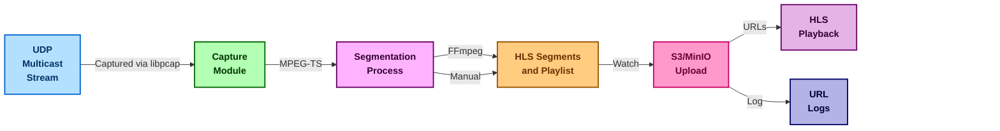

# Rust-Based Multicast MPEG-TS UDP Stream PCAP Capture for S3/MinIO HLS Hourly Archiving and Playback

This Rust application enables capturing of MPEG-TS UDP multicast streams, segmenting them into time-based HLS segments, creating `.m3u8` playlists, and uploading them to MinIO or S3 storage. The segments and playlists can then be signed for secure playback.



---

## Quick Start Guide

### Clone and Build the Project
```bash
git clone https://github.com/groovybits/mpegts_to_s3.git
cd mpegts_to_s3

# Build the application in release mode
cargo build --release
```

### Configure and Run the Components
#### 1. Start MinIO Server
```bash
# Start the MinIO server (uses ./data/ for storage)
scripts/minio_server.py &
```

#### 2. Serve HLS Playlist
```bash
# Create HLS directory for serving the index.m3u8 file
mkdir hls && cd hls

# Run Python HTTP Server to serve files from the ./hls/ directory
../scripts/http_server.py &
```

#### 3. Capture and Segment UDP Stream
```bash
# Capture multicast stream from udp://227.1.1.102:4102 on interface net1
# Segments can be saved to ./ts/ directory with 2-second duration and uploaded to S3/MinIO
SEGMENT_DURATION_SECONDS=10 \
../target/release/mpegts_to_s3 \
    -n net1 \         # Network interface for packet capture
    -i 227.1.1.102 \  # Multicast IP to filter
    -p 4102 \         # UDP port to filter
    --manual_segment \ # Use manual segmentation instead of FFmpeg
    -o ts \           # Output directory for .ts segments
    --diskless_mode   # Diskless mode avoids writing .ts segments to disk
```

#### 4. Playback
- **Direct Playback:**
```bash
mpv -i http://192.168.130.93:3001/index.m3u8
```

- **MinIO Playback:**
  1. Retrieve the signed URL for the desired hour:
     ```bash
     curl -s http://192.168.130.93:3001/ts/urls.log | tail -1
     ```
  2. Setup an SSH tunnel for the HTTP server:
     ```bash
     scripts/minio_admin.sh
     ```
  3. Play back the hourly playlist:
     ```bash
     mpv http://127.0.0.1:9000/ltnhls/2025/01/16/06/hourly_index.m3u8?...(signed_url_params)
     ```

---

## Prerequisites

- **Rust Toolchain:** Install via [Rustup](https://rustup.rs/).
- **MinIO/S3 Server:** Ensure MinIO is available locally or via a container.
- **Dependencies:** Install `libpcap` for packet capture and FFmpeg (optional) for HLS segment generation.
- **Ports:** Open ports 9000 and 9001 for MinIO and the HTTP server.
- **SSH Tunneling:** For HTTP access to MinIO, set up SSH forwarding.

---

## Usage

```bash
mpegts_to_s3 [OPTIONS]
```
### Options:
- **General Settings:**
  - `-e`, `--endpoint`: S3-compatible endpoint (default: `http://127.0.0.1:9000`)
  - `-r`, `--region`: S3 region (default: `us-west-2`)
  - `-b`, `--bucket`: S3 bucket name (default: `ltnhls`)
- **UDP Stream Capture:**
  - `-i`, `--udp_ip`: Multicast IP to filter (default: `227.1.1.102`)
  - `-p`, `--udp_port`: UDP port to filter (default: `4102`)
  - `-n`, `--interface`: Network interface for packet capture (default: `net1`)
  - `-t`, `--timeout`: Packet capture timeout in milliseconds (default: `1000`)
- **HLS Output:**
  - `-o`, `--output_dir`: Local directory for HLS output (default: `hls`)
  - `--remove_local`: Remove local `.ts` and `.m3u8` files after upload
  - `--manual_segment`: Use manual segmentation instead of FFmpeg
  - `--inject_pat_pmt`: Prepend PAT & PMT tables to each segment (if manually segmented)
  - `--hls_keep_segments`: Number of segments to keep in the `.m3u8` index (0 = unlimited, default: `0`)

---

## How It Works

1. **Capture:** The application uses `libpcap` to capture UDP multicast MPEG-TS packets on a specified interface.
2. **Segment:** It either:
   - **Automatically segments** streams with FFmpeg
   - **Manually segments** streams by directly processing MPEG-TS packets
3. **Upload:** A directory watcher uploads new `.ts` segments and playlists to S3 or MinIO.
4. **Playback:** The uploaded segments are accessible via signed or unsigned URLs, enabling HLS playback.

---

## Monitoring and Logs
- **MinIO Web Interface:** View uploaded files via the MinIO web client.
- **Segment Logs:** Signed URL logs are stored in `urls.log` in the output directory.

---

## Example File Structure
```text
hls/
├── index.m3u8
├── 2025/
    └── 01/
        └── 16/
            └── 06/
                ├── segment_20250116-060000__0000.ts
                └── hourly_index.m3u8
```
---

## Development Notes

The full source code is located in the `src/` directory. Additional utility scripts for managing MinIO and HTTP servers are available in the `scripts/` folder.

For questions or issues, refer to the repository's issue tracker.

---

**Author:** Chris Kennedy  
**Date:** January 15, 2025

